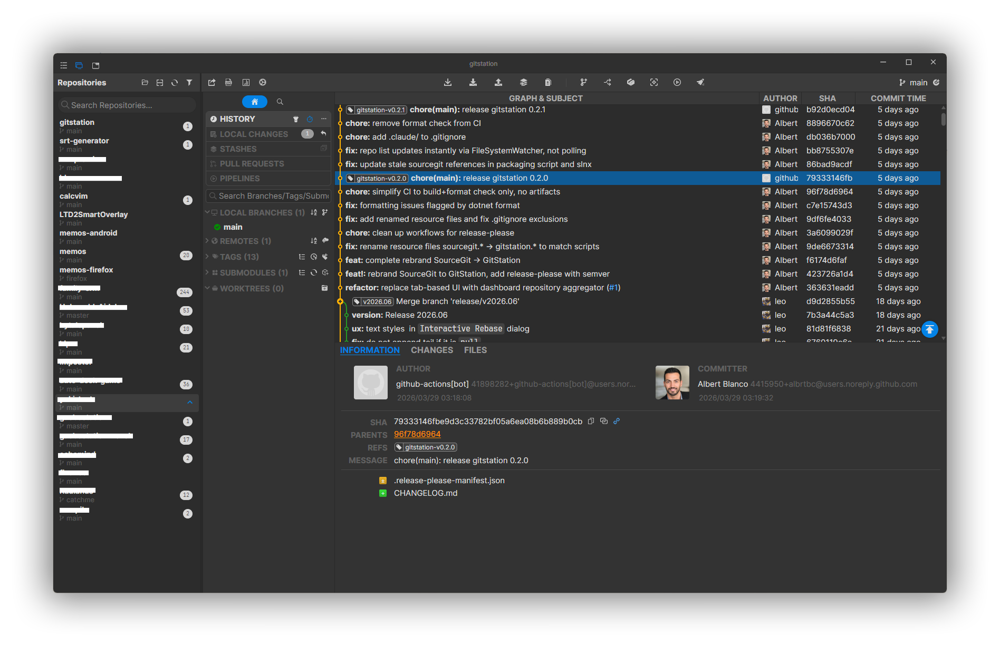

# GitStation - Opensource Git GUI client

[](https://github.com/albrtbc/gitstation/stargazers)
[](https://github.com/albrtbc/gitstation/forks)
[](LICENSE)
[](https://github.com/albrtbc/gitstation/releases/latest)
[](https://github.com/albrtbc/gitstation/releases)

GitStation originally started as a fork of [SourceGit](https://github.com/sourcegit-scm/sourcegit), an excellent open-source Git GUI. It has since evolved into a **standalone project** with its own direction, focused on **GitHub integration**, **AI-powered workflows**, and a **workspace-based repository aggregator**.

> [!NOTE]
> GitStation is currently in **beta**. It is under active development — expect frequent updates, new features, and occasional rough edges. Feedback and contributions are welcome!

## Screenshot



### Built-in Themes

Default, Dark, Light, GitLab Dark, GitLab Light, Dracula, Nord, Monokai, Solarized Dark, Solarized Light

Custom themes are also supported via JSON override files.

## What's Different from SourceGit

* **Repository aggregator** — workspace-based view that groups repositories instead of individual tabs
* **GitHub Pull Requests** — browse, review, approve, merge, squash, and rebase PRs directly from the app
* **GitHub Pipelines** — view CI/CD check runs and status per PR
* **AI PR Review** — analyze pull request diffs with AI and get actionable code reviews
* **AI via CLI tools** — use Claude Code, Codex, Gemini or any CLI-based LLM alongside traditional API services (OpenAI, Azure)
* **Unified AI settings** — single configuration tab for both API and CLI AI services with customizable prompts
* **Optimized commit message generation** — two-phase approach (analyze diff, then generate subject) in just 2 API calls instead of N+1

## Highlights

* Supports Windows/macOS/Linux
* Opensource/Free
* Fast
* Deutsch/English/Español/Bahasa Indonesia/Fran&ccedil;ais/Italiano/Portugu&ecirc;s/Русский/Українська/简体中文/繁體中文/日本語/தமிழ் (Tamil)/한국어
* Built-in light/dark themes
* Visual commit graph
* Supports SSH access with each remote
* GIT commands with GUI
  * Clone/Fetch/Pull/Push...
  * Merge/Rebase/Reset/Revert/Cherry-pick...
  * Amend/Reword/Squash
  * Interactive rebase
  * Branches
  * Remotes
  * Tags
  * Stashes
  * Submodules
  * Worktrees
  * Archive
  * Diff
  * Save as patch/apply
  * File histories
  * Blame
  * Revision Diffs
  * Branch Diff
  * Image Diff - Side-By-Side/Swipe/Blend
* Git command logs
* Search commits
* GitFlow
* Git LFS
* Bisect
* Issue Link
* Workspace
* Custom Action
* GitHub Pull Requests & Pipelines
* AI commit message generation (API + CLI)
* AI pull request review
* Built-in conventional commit message helper

> [!WARNING]
> **Linux** only tested on **Debian 12** on both **X11** & **Wayland**.

## How to Use

**To use this tool, you need to install [Git](https://git-scm.com/) (>=2.25.1) first.**

For GitHub Pull Requests and Pipelines, you also need [GitHub CLI (`gh`)](https://cli.github.com/) installed and authenticated (`gh auth login`).

You can download the latest stable from [Releases](https://github.com/albrtbc/gitstation/releases/latest) or download workflow artifacts from [GitHub Actions](https://github.com/albrtbc/gitstation/actions) to try this app based on latest commits.

This software creates a folder, which is platform-dependent, to store user settings, downloaded avatars and crash logs.

| OS      | PATH                                      |
|---------|-------------------------------------------|
| Windows | `%APPDATA%\GitStation`                     |
| Linux   | `~/.gitstation`                            |
| macOS   | `~/Library/Application Support/GitStation` |

> [!TIP]
> * You can open this data storage directory from the main menu `Open Data Storage Directory`.
> * You can create a `data` folder next to the `GitStation` executable to force this app to store data into it (Portable-Mode). Only works with Windows packages and Linux AppImages.

For **Windows** users:

* **MSYS Git is NOT supported**. Please use official [Git for Windows](https://git-scm.com/download/win) instead.
* Pre-built binaries can be found in [Releases](https://github.com/albrtbc/gitstation/releases/latest)

For **macOS** users:

* If you want to install `GitStation.app` from GitHub Release manually, you need run following command to make sure it works:
  ```shell
  sudo xattr -cr /Applications/GitStation.app
  ```
* Make sure [git-credential-manager](https://github.com/git-ecosystem/git-credential-manager/releases) is installed on your mac.

For **Linux** users:

* `AppImage` files can be found in [Releases](https://github.com/albrtbc/gitstation/releases/latest). `xdg-open` (`xdg-utils`) must be installed to support opening the native file manager.
* Make sure [git-credential-manager](https://github.com/git-ecosystem/git-credential-manager/releases) or [git-credential-libsecret](https://pkgs.org/search/?q=git-credential-libsecret) is installed on your Linux.
* Maybe you need to set environment variable `AVALONIA_SCREEN_SCALE_FACTORS`. See https://github.com/AvaloniaUI/Avalonia/wiki/Configuring-X11-per-monitor-DPI.

## AI Services

GitStation supports two types of AI services for generating commit messages and reviewing pull requests:

### API Services (OpenAI, Azure, etc.)

Configure in `Preferences > AI > + > API Service`:

* **Server** — e.g. `https://api.openai.com/v1` for OpenAI, or `http://localhost:11434/v1` for Ollama
* **Model** — e.g. `gpt-4`, `gpt-3.5-turbo`
* **API Key** — your API key (can be loaded from an environment variable)

### CLI Services (Claude Code, Codex, Gemini, etc.)

Configure in `Preferences > AI > + > CLI Service`:

* **Executable** — the CLI tool name or path (e.g. `claude`, `codex`, `gemini`)
* The tool must support `-p <prompt>` for passing instructions and reading input from stdin

Both service types support customizable prompts for:
* **Analyze Diff** — summarizes the purpose of changes
* **Generate Subject** — produces a conventional commit message
* **Review PR** — performs an AI code review on pull request diffs

## Commandline Arguments

```
<GITSTATION_EXEC> <DIR>                       // Open repository
<GITSTATION_EXEC> --file-history <FILE_PATH>  // See history of a file
<GITSTATION_EXEC> --blame <FILE_PATH>         // Blame a file (HEAD version)
```

## External Tools

This app supports opening repositories in external tools:

| Tool                          | Windows | macOS | Linux |
|-------------------------------|---------|-------|-------|
| Visual Studio Code            | YES     | YES   | YES   |
| Visual Studio Code - Insiders | YES     | YES   | YES   |
| VSCodium                      | YES     | YES   | YES   |
| Cursor                        | YES     | YES   | YES   |
| Sublime Text                  | YES     | YES   | YES   |
| Zed                           | YES     | YES   | YES   |
| Visual Studio                 | YES     | NO    | NO    |

> [!NOTE]
> This app will try to find those tools automatically. For portable versions, add a file named `external_editors.json` in the app data storage directory:
> ```json
> {
>     "tools": {
>         "Visual Studio Code": "D:\\VSCode\\Code.exe"
>     },
>     "excludes": [
>         "Visual Studio Community 2019"
>     ]
> }
> ```

## Contributing

In short, here are the commands to get started once [.NET tools are installed](https://dotnet.microsoft.com/en-us/download):

```sh
dotnet nuget add source https://api.nuget.org/v3/index.json -n nuget.org
dotnet restore
dotnet build
dotnet run --project src/GitStation.csproj
```

## Third-Party Components

For detailed license information, see [THIRD-PARTY-LICENSES.md](THIRD-PARTY-LICENSES.md).

## Acknowledgements

GitStation is a fork of [SourceGit](https://github.com/sourcegit-scm/sourcegit) by the SourceGit contributors. The AI commit message generation feature is a C# port of [anjerodev/commitollama](https://github.com/anjerodev/commitollama).
